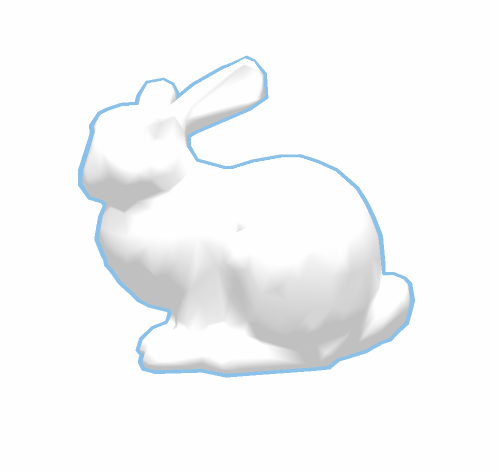

# MeshView
一款网格可视化工具，目前支持vtk、obj、off、pl2文件的读写。可以显示三角网格、四边形网格、六面体网格、四面体网格。
* 网格可视化
 
* 支持多模型读入  
  
* 支持文件拖拽
  
   
* 支持SSAO、SSAA等

 
## 编译
目前只支持windows平台。
如果有vs2019,点击Generate.bat即可生成vs工程文件
否则在命令行输入
~~~
PremakeTools\premake5.exe vs20xx
~~~
## TODO
以后将会实现的特性：
* 多视口
* 跨平台
。